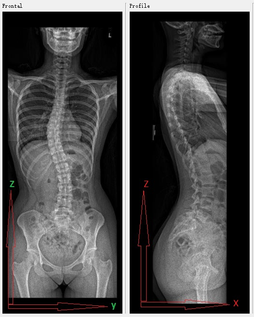

# Manual spine reconstruction

----
## Objective
A tool to reconstruct spine from biplanar X-ray or EOS image. Landmarks are selected by hand or automatic methods. Registration methods are employed to align vertebra models to selected landmarks. 

----
## Implementation details

### 1. 3rd party libraries
1. Qt, version >= 5.1
2. VTK, v>= 6.3
3. Cmake, v>2.8
4. tinyXML2
### 2. Image direction

### 3. File structure

## Usage
To be continued...

